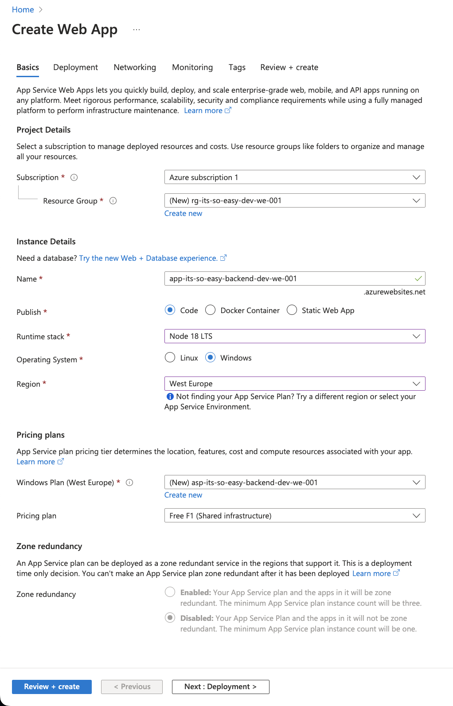

Крок 1: Зареєструйте безкоштовний обліковий запис Azure, якщо ви ще цього не зробили. Це можна зробити на офіційному 
веб-сайті Azure.

Крок 2: Відкрийте [Azure Portal](https://portal.azure.com/) у браузері та увійдіть до свого облікового запису.

Крок 3: На панелі інструментів оберіть "+Створити ресурс" ("+Create a resource").

Крок 4: У пошуковому рядку введіть **App Service** та оберіть **Web App** (Веб-додаток) у списку запропонованих ресурсів.

Крок 5: На сторінці "Веб-додаток" заповніть усі необхідні поля:

| Налаштування | Значення |
| -- | -- |
| Підпіска  ("Subscription") | Оберіть пілписку із списку |
| Ресурсна група ("Resource group") | Оберіть створити нову ("New") та введіть ім'я:  **rg-its-so-easy-dev-we-001** (*) |
| Ім'я додатку ("Name") | Вкажіть унікальне ім'я для вашого додатку наприклад **app-its-so-easy-backend-dev-we-001**(**) |
| Cтек виконання ("Runtime stack"") | Оберіть  **Node 18 LTS** |
| Операційна система("Operation system") | Windows |
| Регіон ("Region") | West Europe (***) |
| Сервіс план ("Windows plan")| Створимо новий сервіс план **asp-its-so-easy-backend-dev-we-001** |
| Ціновой план ("Pricing plan")| оберіть **Free F1** |
| -- | -- |

_(*) - Конвенцію з іменування ресурсів ([Naming convention](https://learn.microsoft.com/en-us/azure/cloud-adoption-framework/ready/azure-best-practices/resource-naming)) можно подивитись за посиланням. (italic)_ 
Стисло це можно побачити на скріні нижче.


_(**) Ім'я для вашого додатку яке буде використовуватись в URL-адресі. Наприклад для обраного ім'я веб адреса (italic)_ 
буде наступною: 
>app-its-so-easy-backend-dev-we-001.azurewebsites.net

_(***) Cаме скорочення від ціх слив "we" використовується в назвах ресурсів (italic)_

Наступний скрін демонструє налаштування для створення веб додатку.



Перейдіть до вкладки **Monitoring** та у розділі  **Enable application insights** оберіть **Yes** 
Натисніть **Review +create** перевірте обрані налаштування та натісніть **Create**
Наступний скрін демонструє сторінку **Review**


    Требо трохі зачекати поки усі ресурси включаючи Ресурсну групу та Сервіс план будуть 
    створені. 

Та після створення натисніть **Go to resource** щоб перейти на сторінку створеного додатку.


На сторінці **Web-app** у блоці **Domains** натісніть на URL  **Default domain** та побачімо стартову
сторінку нашаго новостворенного **Web-app**


    Перший запуск після створення ресурсу або після деплою може тривати декілько хвилин

Крок 6: Розгорніть код додатку у **Web Apps**. Відкрийте командний рядок (термінал) на своєму комп'ютері і авторизуйтеся 
в Azure CLI(****) за допомогою команди:
```shell
az login
```
_(****) щоб встановити Azure CLI перейдіть за посиланням (https://learn.microsoft.com/en-us/cli/azure/install-azure-cli) (italic)_ 
    
Буде відкрито браузер та завантажено сторінку входу до **azure portal**, введить свої логін, пароль та повернитесь 
до вікна терміналу. Надалі потрібно обрати підписку з якою будемо далі працювати. 
Список усіх підписок (**Subscription**) та іх ID буде виведено у термінал після того як логін буде викононо. Будьте уважні
требо обрати саму ту підписку в якої ви сторювали **Web Apps**.
```shell
az account set --subscription <subscription_id>
```
та для завантаження коду додатку використовуємо команду
```shell
az webapp deployment source config-zip --name app-its-so-easy-backend-dev-we-001 --resource-group rg-its-so-easy-dev-we-001 --src backend.zip
```
az webapp config set --resource-group rg-its-so-easy-dev-we-001 --name app-its-so-easy-backend-dev-we-001 --startup-file "index.js"
де:<br>
**name** - ім'я ношого додатку **(Application name)**<br> 
**resource-group** - назва Ресурсної групі **(Resource group)**<br>
**src** - шлях до архіву нашого додатка

Крок 7. Поверніться на сторінку нашого додатку та обновіть її. Першій запуск може зайняти деякий час, та після 
перевантяження побачімо сторінку нашого додатку.


    Створені ресурси будут використані у наступноу кроці, тож як що плануєте 
    продовжувати то залиште їх.

<span style="color:red"> Крок 8.</span> Не забувайте видалити усі створені ресурси. Оскільки оплата стягується 
лише коли вони існують та/або працюють. 

Резюме: використовуючи azure portal ми створили найпростіший веб додаток для роботи з нотатками і задеплоїли 
існуючий і підготовлений код в хмару.
